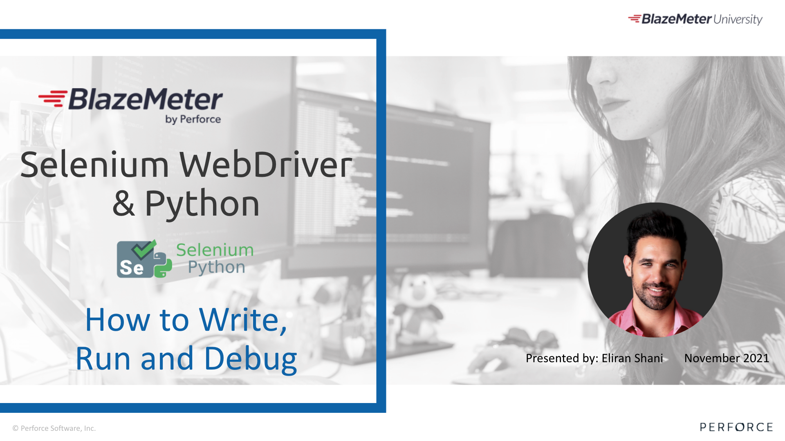
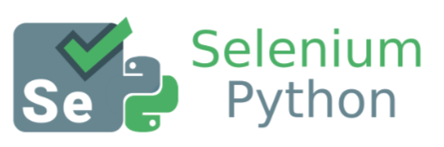
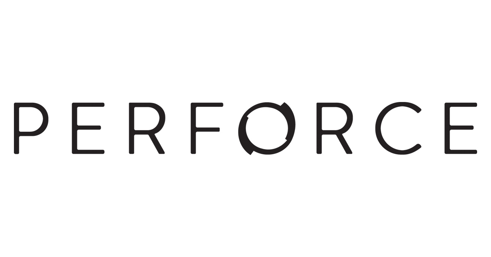

Selenium WebDriver & Python - How to Write, Run & Debug course - Part 1
======================

This repository is all about creating automated testing scripts using Python/Selenium WebDriver/Pytest and run them in scale using BlazeMeter.

## Tech
This repo uses the following open source project:

[Selenium WebDriver](https://www.selenium.dev/documentation/webdriver/)   
Selenium WebDriver is an open source tool for automated testing of web apps across many browsers.   
It provides capabilities for navigating to web pages, user input, JavaScript execution, and more.   
If you wish to create automated tests and monitor the quality of your product, Selenium WebDriver is one of the top tools to achieve exactly that.

    
## PreRequisites
Before diving into this repo, make sure you have the necessary knowledge on the following:

1. [Python fundamentals](https://www.w3schools.com/python)
2. [PyCharm](https://www.jetbrains.com/pycharm/) (or any other code editor as you feel comfortable with)
3. [PyTest basics](https://www.tutorialspoint.com/pytest/pytest_quick_guide.htm)
4. [Selenium WebDriver Python bindings](http://selenium-python.readthedocs.io/api.html)
5. [Github basics](https://product.hubspot.com/blog/git-and-github-tutorial-for-beginners)

## Chapters
1. Chapter # 1 – Introduction to Selenium WebDriver
2. Chapter # 2 – Installation Steps (IDE, Python, Selenium WebDriver)
3. Chapter # 3 – Creating & Running Selenium WebDriver Test under Chrome
4. Chapter # 4 – Useful Libraries &  must-use Functions
5. Chapter # 5 – How to Debug Selenium WebDriver Tests with PyCharm
6. Chapter # 6 – Intro to Page Object Model (POM) Testing Architecture
7. Chapter # 7 – Selenium Grid & Remote WebDriver
8. Chapter # 8 – Integrate Selenium Tests into BlazeMeter
9. Chapter # 9 – Parallel Running of Selenium Tests

## Installation
Follow these steps to install all requirements of this repo on to your environment:

1. Create a python virtual environment  
`python3 -m venv venv`   
2. Activate your virtual env  
`source venv/bin/activate` [Mac]  
`c:\path\to\venv\Scripts\activate.bat` [Windows10]   
3. Install selenium + pytest  
`pip install selenium`  
`pip install pytest`   
4. Download [chromeDriver](https://chromedriver.chromium.org/downloads) and [geckoDriver](https://github.com/mozilla/geckodriver/releases)  
*Make sure the binary driver you download matches your current installed chrome/FF version   
5. Store the binary files in the virtual env  
*MAC* : `venv/bin`  
*Windows* : `venv/Scripts`  

## Running existing tests
#### Chapter 3
**Run your first selenium test**
* Checkout branch: *chapter#3-create-and-run-first-selenium-test*
* Make sure you have activated you virtual environment
* Run the test using the following command:  
`pytest test_demo.py`  
*Chrome browser should be initiated and a login flow should be running automatically.  

#### Chapter 6
**Run tests under page object model pattern**
* Checkout branch: *chapter#6-page-object-model-intro
* Make sure you have activated you virtual environment
* Required environment variables: `BASE_URL`,`USERNAME`,`PASSWORD`  

To run a specific test:  
`BASE_URL=<BASE_URL> USERNAME=<USERNAME> PASSWORD=<PASSWORD> pytest test_homepage.py`

#### Chapter 8
**Run tests integrated with Blazemeter**
* Checkout branch: *chapter#8-integrate-selenium-tests-into-blazemeter*
* Make sure you have activated you virtual environment
* Required environment variables:
`BASE_URL`,`USERNAME`,`PASSWORD`, `API_KEY`, `API_SECRET`  
* Generate api keys from `a.blazemeter.com`
To run a specific test:  
`BASE_URL=<BASE_URL> USERNAME=<USERNAME> PASSWORD=<PASSWORD> API_KEY=<API_KEY> API_SECRET=<API_SECRET> pytest test_homepage.py`

#### Chapter 9
**Run tests integrated with Blazemeter in parallel**
* Checkout branch: *chapter#9-parallel-running-of-selenium-tests*
* Make sure you have activated you virtual environment
* Install `pytest-xdist` by running the following command:  
`pip install pytest-xdist`
* Required environment variables:
`BASE_URL`,`USERNAME`,`PASSWORD`, `API_KEY`, `API_SECRET`  
* Required commandline arguments: `-n 2` (2 parallel runs are available for free blazemeter users)
* To run a specific test in parallel (2 concurrent browsers):  
`BASE_URL=<BASE_URL> USERNAME=<USERNAME> PASSWORD=<PASSWORD> API_KEY=<API_KEY> API_SECRET=<API_SECRET> pytest test_homepage.py -n 2`

### Tested Website
* Website: http://dbankdemo.com/bank/login
* username: _jsmith@demo.io_
* password: _Demo123!_

### References and links

1. [Perforce BlazeMeter University](https://www.blazemeter.com/university/)
2. [Perforce BlazeMeter Selenium WebDriver Course - Part 1](TBA)
3. [W3Schools - CSS Selectors](https://www.w3schools.com/cssref/css_selectors.asp)
4. [W3Schools - CSS Selectors Playground](https://www.w3schools.com/cssref/trysel.asp)
5. [Selenium with Python official website](https://selenium-python.readthedocs.io/)
6. [Selenium 4](https://www.blazemeter.com/blog/whats-new-in-selenium-four)

